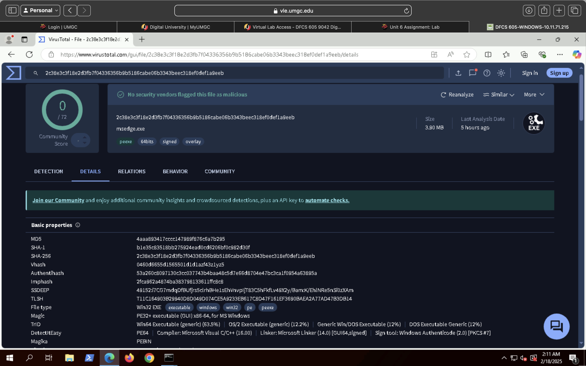
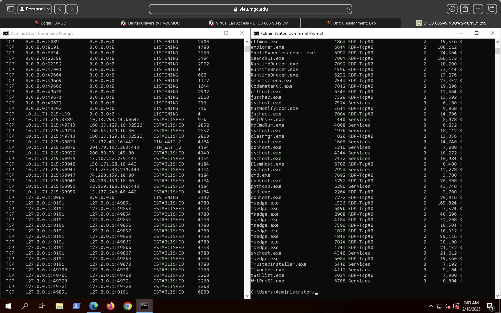

# Host-Based Forensic Analysis

## Analysis Overview
This host-based forensic analysis focused on triaging a live system to identify indicators of suspicious or malicious activity. The investigation examined running processes, active network connections, and associated executable artifacts to determine whether observed behavior represented normal system activity or warranted escalation and remediation.

The analysis methodology reflects common SOC and DFIR triage practices used to rapidly assess endpoint risk while minimizing system impact.

## Process Enumeration and Behavioral Review
Running processes were enumerated to establish a baseline view of system activity at the time of analysis. Each process was reviewed based on executable name, execution path, and observed behavior to identify anomalies such as:
- Unexpected or unfamiliar executables
- Processes executing from non-standard directories
- Irregular parent-child process relationships

This review enabled prioritization of processes requiring deeper validation.

## Network Connection Analysis
Active network connections were examined to identify external communications and listening services associated with running processes. Connections were assessed for:
- Unusual destination addresses
- Unexpected ports or protocols
- Persistent outbound connections that could indicate command-and-control behavior

Process identifiers (PIDs) were correlated with network connections to attribute network activity to specific executables.

## Executable Validation and Reputation Assessment
Executable files associated with processes requiring additional scrutiny were identified for validation. File metadata was reviewed and cryptographic hash values were generated to support reputation-based analysis.

Hashes were prepared for correlation with threat intelligence sources to determine whether the executables were known, trusted binaries or potentially malicious artifacts.

## Correlation and Contextual Analysis
Process behavior, network activity, and executable validation results were correlated to provide investigative context and reduce false positives. Legitimate system and application activity was differentiated from suspicious behavior by evaluating:
- Expected application behavior
- Known system service execution patterns
- Consistency between process function and observed network activity

This correlation step was critical in determining which artifacts represented benign activity versus those requiring escalation.

## Accuracy and Validation Controls
Analysis steps were documented and conducted in a repeatable manner to support accuracy and defensibility. Observations were cross-referenced across multiple data sources, including process listings, network connections, and executable metadata, to ensure findings were supported by corroborating evidence.
