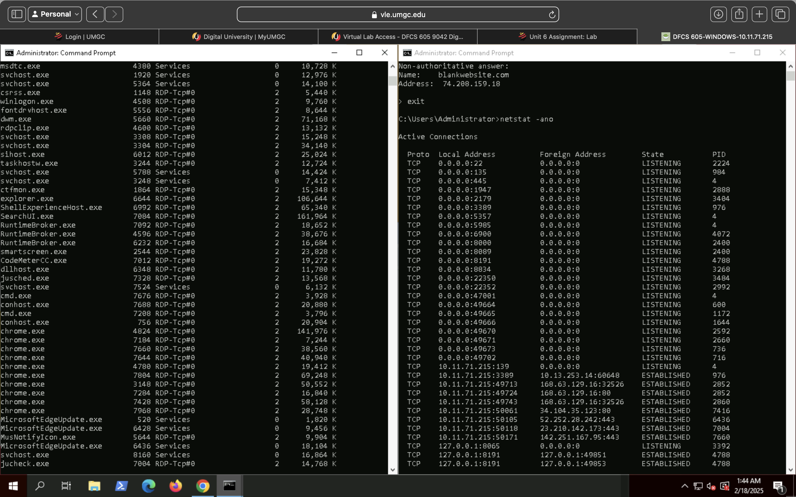

# Evidence and Data Collection

## Evidence Description
The evidence examined in this investigation consisted of live system data collected from a running host during a host-based forensic analysis. Data was gathered to identify running processes, active network connections, and executable files requiring further review.

## Evidence Sources
| Source | Description |
|------|-------------|
| Process Listings | Enumeration of active processes running on the host system |
| Network Connections | Active TCP/UDP connections and listening services |
| Executable Files | Files associated with suspicious or unknown processes |
| Command Output | Output generated from system and network diagnostic commands |

## Data Collection Method
Live-response data was collected using native operating system utilities and command-line tools to minimize system impact while preserving volatile information. Commands were executed in a controlled sequence to capture process and network state at the time of investigation.

## Validation Approach
Suspicious executables identified during analysis were validated using cryptographic hash generation and threat intelligence correlation. Results were reviewed to assess legitimacy and identify potential indicators of compromise.

## Integrity Considerations
While live system analysis involves volatile data, steps were taken to ensure accuracy and reliability by documenting command usage, capturing outputs immediately, and avoiding unnecessary system interaction. Findings were corroborated across multiple data sources where possible.

## Host Network Configuration

The `ipconfig` command was executed to document the system’s active network interfaces, assigned IP addresses, subnet masks, and default gateways at the time of analysis.

## Active Network Connections

The `netstat -ano` command was used to enumerate active TCP and UDP connections, listening ports, and associated process identifiers (PIDs).

## Process Enumeration and PID Mapping

The `tasklist` command output was reviewed and correlated with network connection PIDs to associate active connections with running processes.

