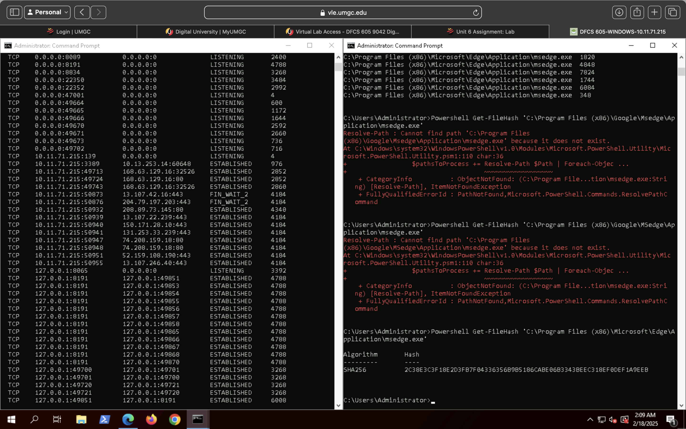

# Investigation Findings

## Summary of Findings
The host-based forensic analysis did not identify evidence of malicious activity on the examined system. While multiple active network connections and running processes were observed, all identified activity aligned with expected behavior for a live Windows host operating under normal user interaction.

Processes and network connections were reviewed, correlated, and validated using native system utilities and external threat intelligence sources. No indicators of compromise, unauthorized persistence mechanisms, or suspicious executable behavior were identified during the investigation.

## Network Activity Findings
Analysis of active network connections revealed multiple established TCP and UDP sessions, including outbound connections to external IP addresses over standard ports such as 80 and 443. These connections were consistent with normal web browsing activity and operating system services.

No unusual listening ports, anomalous foreign IP addresses, or persistent connections indicative of command-and-control infrastructure were identified.

**Supporting Evidence – Active Network Connections (netstat):**

## Process Analysis Findings
Process enumeration identified standard Windows system processes and user-initiated applications, including web browsers and system utilities. No unauthorized processes, unexpected executable locations, or suspicious parent-child process relationships were observed.

Processes associated with active network connections were reviewed and found to align with legitimate applications operating within expected directories.

**Supporting Evidence – Process Enumeration and PID Correlation:**

## Executable Validation Findings
Executable validation was performed on selected binaries associated with active network connections. Cryptographic hashes were generated and analyzed using external threat intelligence sources.

The reviewed executables, including msedge.exe, were confirmed as legitimate and digitally signed, with no detections reported by security vendors. These results support the conclusion that observed network activity originated from trusted applications.

**Supporting Evidence – Executable Validation (VirusTotal):**

## Correlation Findings
Correlation of process, network, and executable data demonstrated consistent and expected system behavior. Network connections were successfully mapped to legitimate running processes, and associated executables were validated as trusted binaries.

No discrepancies were identified between process behavior, network activity, and executable integrity that would suggest malicious or unauthorized activity.

## Overall Assessment
Based on the evidence collected and analyzed, the system exhibited no indicators of compromise at the time of investigation. All observed activity was consistent with normal Windows host behavior during active use.

The investigation confirms the absence of malicious persistence, unauthorized network communications, or suspicious executable execution. Continued monitoring and standard endpoint security controls are recommended to maintain system integrity.
